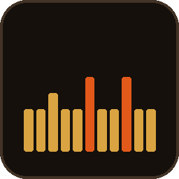

# Game Hue Flicker Console

Drives Philips Hue lights with the flicker patterns of twenty classic games —
Blood, Descent, Deus Ex, DOOM, Doom 3, Duke Nukem 3D, Half-Life, Half-Life 2,
Heretic, Hexen, Marathon, Quake, Quake II, Quake 4, Rise of the Triad, Shadow
Warrior, System Shock 2, Thief, Unreal and Unreal Tournament — through a small
web UI that multiple people on your network can use at once.



## What it does

- Talks directly to your Hue Bridge's local API (no cloud account needed).
- Runs each light's flicker as its own async loop, all going through one
  shared rate limiter so you can't accidentally flood the bridge.
- Serves a web UI for picking lights, patterns, speed (Hz), brightness
  range, transition time, and an optional color.
- Broadcasts live state over a WebSocket, so if two people have the page
  open, they see the same running/stopped state and controls in real time.
- Lets you write and save custom a–z lightstyle strings as reusable
  patterns, with a live waveform preview and their own speed, brightness
  range, transition and colour.
- Exports your patterns to a small JSON file you can share, and imports
  files other people send you.
- Retunes running lights on the fly — pattern, speed, brightness and color
  all take effect mid-flicker, no stop-and-restart.
- Groups any set of bulbs behind one set of controls, flickering in step,
  and can copy the rooms and zones already set up in the Hue app.
- Reads each bulb's colour and brightness before it starts, and puts it back
  when the flicker stops — even if the container was killed mid-run.
- Optionally locks the console behind a password you set in the UI.
- Persists everything in `/data/config.json` (mount that as a volume so it
  survives container restarts).

**Everything is configured from the web UI.** The container takes no
environment variables beyond the config path — bridge pairing, custom
patterns, the send-rate cap and the console password all live in the
Settings panel and in `config.json`.

## Install on Unraid

The easiest route is the template in this repo:

1. In Unraid, go to **Docker → Add Container**, and paste this into the
   *Template* field at the top:

   ```
   https://raw.githubusercontent.com/Krippler/LightHue/main/unraid-template.xml
   ```

2. Check the two settings it fills in:
   - **WebUI Port** — defaults to `26000`, Quake's own registered port, chosen
     to stay clear of the 8080 crowd on a typical Unraid box. Change it if you
     already use it for something.
   - **Config Storage** — defaults to `/mnt/user/appdata/game-hue-flicker`.
     This holds your bridge pairing, saved patterns and console password.
     Keep it mapped or you'll re-pair after every update.

3. **Apply**, then open the WebUI from the Docker tab.

The image is published to `ghcr.io/krippler/lighthue:latest` and rebuilt on
every push to `main`, so Unraid's update check works normally.

**If bridge discovery or pairing fails**, set *Network Type* to **Host** on
the container and try again. Some Unraid setups don't let the default bridge
network reach the Hue Bridge or the discovery endpoint.

Host networking ignores port mappings — the container binds the server's port
directly. If 26000 is taken there, add a `PORT` variable to the container
instead of changing the port mapping.

## Run it anywhere else

```bash
docker compose up -d --build
```

Then open `http://<your-server-ip>:26000`. To use the published image instead
of building, swap the `build: .` line in `docker-compose.yml` for
`image: ghcr.io/krippler/lighthue:latest`.

**First run:** the UI will prompt you to either auto-discover your bridge
or enter its IP manually, then walk you through pairing (press the
physical link button on the bridge, then hit Pair within ~30 seconds).

It has to be an IP address, not a host name — `192.168.1.23`, or
`192.168.1.23:8080` if you run something like diyHue on another port. That
string decides which machine the console makes requests to, so it is checked
before anything is sent: host names are refused (no name lookup means nothing
can point one somewhere else later), as are loopback, link-local, multicast
and reserved addresses, none of which a bridge is ever on. Any other address
works, so a bridge across a VPN or a routed subnet is fine.

## Patterns

Every built-in pattern is named after the game it comes from, and the picker
groups them by game, listed alphabetically. There are two kinds, and the
difference is worth knowing:

**Straight from the engine.** Quake stored its light effects as literal `a`–`z`
strings — styles 0–11 plus 63 — and they're here transcribed from id's released
source, not from memory. Quake II ships that table byte for byte. GoldSrc
(Half-Life) and Source (Half-Life 2, Portal, TF2, Left 4 Dead) ship it too and
add style 12, the underwater mutation.

Because those are literally the same strings, they exist once and are *shared*
into each game's menu rather than copied — `shared_with` in the API. Picking
"Quake II — 4 Fast Strobe" and "Quake — 4 Fast Strobe" runs the same lightstyle,
because in the engines it is the same lightstyle. The same goes for the Unreal
Engine 1 games: Unreal Tournament and Deus Ex list Unreal's `LT_*` light types.
Copying the strings would have filled the picker with dozens of identical
effects under different names.

The exact tables are pinned in `tests/test_patterns.py` against the four
released sources, because a wrong style 8 sat here unnoticed until someone
checked.

**Written here, in that style.** Everything else — DOOM and its descendants
(Heretic, Hexen), the Build games (Duke Nukem 3D, Blood, Shadow Warrior), the
Dark engine games (Thief, System Shock 2), id Tech 4 (Doom 3, Quake 4),
Descent, Marathon, Rise of the Triad and Unreal — doesn't store light effects
as strings at all. They run procedural sector, actor and material effects in
code. Those presets are hand-authored sequences approximating the documented
behaviour at roughly the original timing. They're a tribute, not a dump of
engine data, and the API marks them `origin: "inspired"` so you can tell them
apart. The picker says which is which on hover.

**Quake III Arena is deliberately absent**: id Tech 3 ships no default
lightstyle table in its game code, so there's nothing verbatim to claim.

**Every pattern carries its own framing** — speed, brightness window,
transition and colour, not just the letters. A sputtering bulb and a slow
gothic throb aren't the same shape played faster or slower, so picking a
pattern brings all of it along and the light looks right without you tuning
anything:

| | |
|---|---|
| Blood — Guttering Torch | 10 Hz, 40–215, 100 ms, warm orange |
| Shadow Warrior — Paper Lantern | 4 Hz, 60–200, 300 ms, soft amber |
| Doom 3 — Corridor Strobe | 12 Hz, full range, hard steps, no colour |
| Hexen — Slow Mana Pulse | 5 Hz, 20–230, 200 ms, violet |
| Quake 4 — Strogg Machinery | 8 Hz, 35–225, 100 ms, sickly green |

Flame effects keep a brightness floor and a little smoothing, because a real
flame doesn't go out between frames. Failing tubes and strobes do the opposite:
they snap, and they go dark. You can still drag any slider afterwards and it
sticks.

**Colour is opt-in per pattern.** Half of them name one — torches are orange,
neon is magenta, emergency lighting is red — and half deliberately don't, so
they leave whatever colour you set in the Hue app alone. Unticking **Set
color** overrides a pattern that names one; the brightness framing still
applies.

Under each swatch is a box you can type a colour into, which is the way to get
an exact one. It takes either form:

| You type | You get |
|---|---|
| `6000,225` | exactly that — Hue's own hue and saturation |
| `#ff991d` | the nearest hue/sat, `5993,225` |
| `#f80` | shorthand hex, expanded |

`hue,sat` is the exact form because it's what the bridge actually takes and
what the pattern table stores; a trip through RGB has to round. The box shows
the numbers being sent, so picking a preset tells you its exact colour. Typing
something unparseable marks the box red and changes nothing.

The engine-sourced styles are deliberately left unframed: full range, no
smoothing, no colour, and all 10 Hz because that is the rate those engines step
the lightstyle table at. Their `a`–`z` curve *is* the whole brightness story,
and colour came from the map's light entity rather than the style, so framing
them would misrepresent them.

Transitions move in 100 ms steps, because that is the resolution the bridge
accepts — anything finer is truncated on the way through.

Add your own in `app/patterns.py`, or write them in the UI (see below).

## Sharing patterns

Custom patterns can be moved between consoles as a file. **Export to file** in
the Custom Lightstyles panel downloads everything you've written; **Import from
file** loads one someone sent you.

The format is deliberately small, so a pack can be written by hand in a text
editor and sent to someone who then just imports it:

```json
{
  "format": "game-hue-flicker/patterns",
  "version": 1,
  "name": "Doom 3 style flicker",
  "author": "someone",
  "patterns": [
    {
      "name": "Sputtering Lamp",
      "sequence": "mmnnaamm",
      "hz": 12,
      "min_bri": 40,
      "max_bri": 220,
      "transition_ms": 100,
      "hue": 6000,
      "sat": 220
    }
  ]
}
```

Only `patterns` is required — `{"patterns": [...]}` on its own imports fine.
Each pattern may state the framing it was written for; anything it leaves out
falls back to Quake's own defaults, 10 frames a second across the bulb's full
range with no smoothing and no colour of its own. `hue` and `sat` go together
or not at all.
Sequences are normalised on the way in, so spacing and capitalisation don't
matter. Unknown keys are ignored, which leaves room for packs to carry extra
metadata without older consoles choking on it.

Importing never overwrites anything you already have:

- A pattern whose sequence you already have — under any name, custom or
  built-in — is skipped and reported, because two names for one identical
  effect is just clutter in the picker.
- A pattern whose *name* collides but whose sequence differs is added as
  "Torchlight (2)" rather than replacing yours.
- If any entry in the file is malformed the whole import is refused and
  nothing changes, with a message naming the entry at fault.

Exported files contain only names and sequences — no bridge details, no
credentials, nothing console-specific — so they're safe to pass around.

## Groups

Tick the lights you want to run together in the **Groups** panel, give them a
name, and they get one card whose controls drive all of them at once. Members
keep their own cards too, so you can still tweak one light without leaving the
group.

**Or copy one from the bridge.** The Hue app already knows your lighting as
*Rooms* (a light belongs to exactly one) and *Zones* (any set, overlapping
allowed). **Use a room from the bridge** lists both and copies one over in a
click, rather than making you pick the same bulbs again. LightHue's groups
behave like zones, so either kind copies across fine.

The button is a toggle — it reads *Hide bridge rooms* and highlights while the
list is open, and the list appears directly beneath it.

Luminaires and Entertainment areas aren't offered: the first describes the
innards of a single fitting, the second belongs to Hue's streaming API. A room
containing a bulb this console can't see is listed with that noted and no Add
button, because driving a light id that isn't there just burns bridge budget.

A group card shows `2/3 FLICKERING` when only some members are running, and
offers **Start the rest** alongside **Stop** so you can bring stragglers into
line without interrupting the ones already going.

**Staying in step.** Lights in a group are given a shared start instant, and
each one works out which frame of the pattern is due *now* from that instant
rather than counting its own ticks. That matters because the bridge budget is
shared: a light that gets served less often would otherwise fall progressively
further behind, and a group would drift apart the longer it ran. The rate
limiter still hands out slots one at a time — bulbs physically cannot be sent
to simultaneously — so the residual offset is one limiter slot, not a growing
gap.

If you ask for more frames per second than a light's share of the budget can
carry, the pattern is run at the rate that share allows rather than sampled at
the higher one. Sampling would alias: a two-frame strobe served every second
frame sits on one value and stops flickering altogether. The card shows the
rate it's actually running at whenever that's below what you asked for.

## Changing things mid-flicker

Every control retunes a running light in place — pattern, speed, brightness
window, transition and color all apply without restarting the loop, and the
change reaches everyone else's browser over the WebSocket.

The color swatch is always live, and starts from the color the bulb is actually
showing rather than a fixed default. Picking a color ticks **Set color** for you
rather than making you find the box first. Leaving that box unticked means the
console won't touch the bulb's color at all — useful when you've already set a
color in the Hue app and just want the flicker.

Unticking **Set color** mid-run doesn't revert anything on its own; it just
stops sending further color changes. Stopping the flicker is what puts the bulb
back — see below.

## Putting lights back

Before a light starts flickering, the console reads its current state off the
bridge — on/off, brightness, and whichever of hue/sat, xy or ct the bulb is
actually using — and keeps it. Stopping the flicker restores exactly that.
Restarting a light that's already running keeps the *original* snapshot, so the
thing you get back is always the state from before any of this started.

That snapshot is written to `config.json`, so a container that dies mid-flicker
still puts the bulbs back on its next start rather than leaving them stuck at
whatever brightness the last tick happened to land on.

Turn it off with **Restore lights to how they were** in Settings if you'd rather
lights stay where the flicker ends. The snapshot is still kept either way, and
each card grows a **Revert** button you can hit whenever you want it back.

## Entertainment streaming

The ordinary path sends one HTTP command per light, and the bridge takes about
ten a second in total for everything. That budget is shared, so the more lights
flicker at once the slower each one gets:

| lights | at 10/sec | at 20/sec | at 30/sec |
|-------:|----------:|----------:|----------:|
| 2      | 4.00 Hz   | 8.00 Hz   | 12.00 Hz  |
| 4      | 2.00 Hz   | 4.00 Hz   | 6.00 Hz   |
| 7      | 1.14 Hz   | 2.29 Hz   | 3.43 Hz   |

Seven bulbs at a real 10 Hz would need about 88 commands a second, which is not
something the REST API will do at any setting.

**Entertainment streaming is the way past that.** One UDP socket carries a
frame holding every light in the area, so a frame costs the same whether it
holds one bulb or ten, and the speed stops being divided — up to 25 Hz across
the whole area at once, every light changing on the same frame.

### Putting the console on the bridge's network

If the bridge sits on its own VLAN — an IoT network, say — the console has to
join it for streaming to work. Everything else routes across the boundary
happily, so this only bites the one feature.

On Unraid, the way to do that is a Docker network on the bridge's VLAN rather
than the default bridge or host networking:

```bash
docker network create -d ipvlan \
    --subnet=192.168.50.0/24 --gateway=192.168.50.1 \
    -o parent=bond0.50 hue-vlan
```

then set the container's network to `hue-vlan`.

The parent has to be a real interface *on that VLAN*. Check first:

```bash
ip -4 addr | grep 192.168.50.
```

Nothing there means the VLAN is not reaching the server, and no Docker network
can conjure it: frames would still leave untagged on the parent's own VLAN,
giving the container an address on a network it cannot actually reach. Trunk
the VLAN to the server and add it under Settings → Network Settings first, so
a `bond0.50` (or equivalent) exists to hang the Docker network off.

Use `-d macvlan` instead of `ipvlan` if Unraid is not in ipvlan mode; a `vhost0`
interface alongside `bond0` means it is.

To test before rearranging anything: if the host does have an address on the
bridge's network, `scripts/probe_stream.py --from <that-address>` speaks from it
directly and answers the question without moving the container.

**The client has to be on the bridge's own network.** This is the one part of
the Hue API with that constraint, and it is easy to miss because nothing else
has it: discovery, pairing, rooms and the ordinary per-light flicker all route
across subnets happily. A console on `192.168.10.x` talking to a bridge on
`192.168.50.x` will do everything except stream, and the failure looks like a
handshake timeout rather than anything to do with routing. Diagnostics reports
whether the two are on the same network.

**The DTLS client.** Streaming opens a DTLS 1.2 connection secured with a
pre-shared key, and the console carries its own minimal client for it. That is
not invented-here: python-mbedtls offers, in its ClientHello, an SCSV
pseudo-suite beside the real one plus signature_algorithms, encrypt_then_mac,
extended_master_secret and session_ticket, and exposes no way to turn any of it
off. Bridges have been seen answering a bare ClientHello and ignoring that one.
So the console offers a single cipher suite and no extensions, and falls back to
mbedtls if that fails. Diagnostics reports which one got through.

Three other things it needs:

1. **An entertainment area**, set up in the Hue app under *Entertainment
   areas*. The bridge will only stream to one it already knows about, it holds
   at most ten lights, and they have to be colour-capable.
2. **A pairing that includes a streaming key.** The DTLS pre-shared key is only
   issued when the pairing request asks for it, and there is no way to fetch
   one for an existing user — so a console set up before this feature has to
   pair again. The panel says so when that applies.
3. **Nothing else streaming to the same area.** Hue Sync and games claim the
   area exclusively; areas already taken are listed but greyed out.

While an area is streaming the bridge ignores everything else for those lights,
including the Hue app, so the console hands the area back when you press Stop,
when the sender stops for any reason at all, and on the way out if the container
is stopped mid-stream.

Streaming leaves each bulb on whatever the last frame held, so the console
reads the area's lights before it claims the area and puts them back after it
releases it — the same snapshot the normal path uses, and in that order,
because a bridge that is streaming to an area ignores anything else sent to
those lights.

Stopping sends the bridge a DTLS close_notify before dropping the socket. That
is not a nicety: the bridge allows one entertainment session and keeps it on
its books until it is told the last one ended, so a stream that closes quietly
leaves a ghost session that blocks the next handshake until the bridge times it
out on its own. Streaming once and then never again, with no other symptom, is
what that looks like.

On startup the console hands back any entertainment area the bridge still
records as claimed by its own API key. That covers the case nothing else does:
a container killed, redeployed or crashed mid-stream leaves the claim behind,
and until something clears it those lights answer to nothing at all.

**If a stream is left claimed** — a killed container, a dropped network — the
bridge keeps holding the area, and from the outside that looks like it simply
ignoring the streaming port: the area is accepted and then the handshake times
out. Starting a stream clears a claim this console left behind before making
its own, so that usually sorts itself out. **Release area** clears one by hand,
including a claim left by something else, which beats restarting the bridge.
**Diagnostics** shows what the bridge says about each area, whether UDP reaches
the streaming port, and what the last start attempt actually did, step by step.

That UDP line matters more than it looks. A handshake that times out means the
bridge said nothing, and three quite different things cause that. A bare DTLS
ClientHello, sent *while the area is claimed*, tells them apart:

| how far it gets | what it means |
|---|---|
| **server-hello** | The bridge accepted the offer and would have gone on to check a key. Path fine, port open — so the streaming key is the problem. Pair again for a matching key and API key. |
| **hello-verify-only** / **alert** | It answers but rejects our ClientHello. That is the offer, not the key: the key is not sent until several messages later. |
| **refused** (ICMP port unreachable) | The path is fine — the refusal itself had to reach you — but the port is shut. A bridge that says it holds the area and still refuses took the v1 claim without arming the stream behind it. |
| **silent** | Nothing arrived, or nothing came back. The only one that is a network problem. |

The probe has to go as far as ServerHello because the PSK identity is not sent
until the fifth message of the handshake. Everything before that is identical
whether the key is right or hopeless, so a probe that stops at the first reply
cannot tell a rejected key from a rejected offer.

Note the middle row: an ICMP refusal is *proof of reachability*, not evidence
of blockage. It also means the probe has to run while the area is claimed — the
bridge only binds the port while it holds one, so probing after the release
measures a closed port and calls a healthy network broken.

`scripts/probe_stream.py` does the same standalone, and goes one better: it
claims an area, tries the real handshake, and if that fails re-claims and tries
a hand-rolled one offering a single cipher suite and no extensions. Same bridge,
same claim, seconds apart. If the hand-rolled one gets through where the library
does not, the bridge is willing and the client is the problem — which nothing
else here can establish.

It is one file with no dependencies beyond the standard library, so it can be
copied anywhere that can see the bridge:

```bash
scp scripts/probe_stream.py someone@192.168.50.50:/tmp/
python3 /tmp/probe_stream.py 192.168.50.31 <api-key> <client-key>
```

Working from a machine on the bridge's own network and failing from elsewhere
is the single most useful thing to know, and that test is worthless if the tool
needs a checkout to run. It also ships in the image, so it runs where the
console does:

```bash
docker exec -it lighthue python3 /srv/scripts/probe_stream.py --config /data/config.json
```

For a failure that only happens sometimes, `--repeat` runs the same attempt on
a loop and reports the shape of it rather than one sample:

```bash
docker exec -it lighthue python3 /srv/scripts/probe_stream.py \
    --config /data/config.json --repeat 20 --interval 20
```

Evenly spaced successes mean state carried from one attempt to the next.
Scattered ones mean loss. Those want completely different fixes, and one
attempt cannot tell them apart.

`--config` reads the bridge address and both keys from the console's own config,
which beats copying a 40-character key onto a command line and into shell
history. Passing them explicitly still works.

Only the library handshake needs `python-mbedtls`; the hand-rolled one is
standard library alone, so the script still says something useful when it is
run somewhere the dependency is missing.

Streaming has no transition setting: every frame is sent, so there is nothing
to interpolate between.

## Settings

Open **Settings** in the bar above the panels.

**Bridge send rate.** A global ceiling on commands per second across every
flickering light. Philips advises against sustained bursts past ~10/second,
which is the default. The limiter serializes updates rather than dropping
them, so with enough lights × Hz the *effective* per-light update rate falls
below what you asked for — several lights at 10 Hz will each visibly slow
down. That's the trade for not overwhelming the bridge.

**Console password.** Off by default: anyone who can reach the port can drive
your lights. Set a password and every API route and the WebSocket start
requiring it, with a login prompt on the page. Passwords are stored as a
PBKDF2-SHA256 hash, never in the clear, and changing one signs out every
other open console. Scripts can authenticate with a header instead of the
session cookie:

```bash
curl -H 'X-Console-Password: yourpassword' http://server:26000/api/lights
# or: -H 'Authorization: Bearer yourpassword'
```

Even with a password set, this is a LAN tool — don't port-forward it.

Panels can be dragged into whatever order you like — grab the grip at the left
of a panel's title bar — and clicking a title bar folds that panel away. Both
are remembered per-browser; **Reset layout** puts the order back.

## Project layout

```
app/
  main.py            FastAPI routes + WebSocket
  auth.py            Optional console password + gating middleware
  hue_client.py      Hue Bridge HTTP client (discover/pair/lights/state)
  flicker_engine.py  Per-light async flicker loops + rate limiter
  patterns.py        Built-in flicker patterns, by game
  packs.py           Shareable pattern-pack file format
  config_store.py    Persisted JSON config (bridge creds, patterns, settings)
static/
  index.html, style.css, app.js   The control UI
tests/                            pytest suite
unraid-template.xml               Unraid Community Applications template
```

## If the UI looks stale

The badge beside the header's status light shows the build of the interface
the page is running, and
`GET /api/version` reports the same string. Asset URLs carry that version and
the page itself is served `no-store`, so a rebuild always reaches the browser
rather than sitting behind a cached `app.js`. If that badge doesn't change
after an update, the container is still serving the old files — rebuild and
pull rather than hunting for a UI bug.

## Development

```bash
pip install -r requirements-dev.txt
CONFIG_PATH=./data/config.json uvicorn app.main:app --reload --port 26000

pytest        # API, auth, flicker engine, config store, patterns
ruff check .  # lint
```

CI runs the suite on Python 3.11 and 3.12, plus a Docker build-and-boot
check, on every push and pull request.

## Extending it

- Add more built-in patterns in `app/patterns.py`.
- The `/api` routes are plain REST + one `/ws` WebSocket — easy to script
  against from Home Assistant, a Stream Deck plugin, etc.
